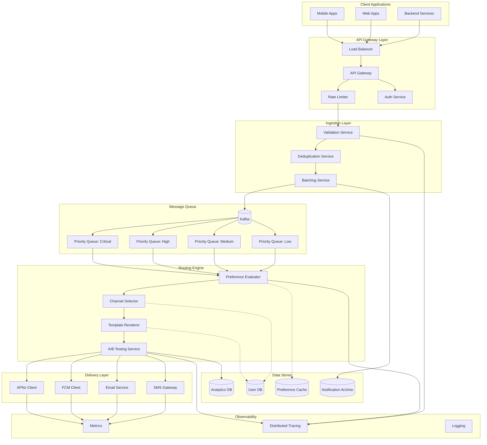
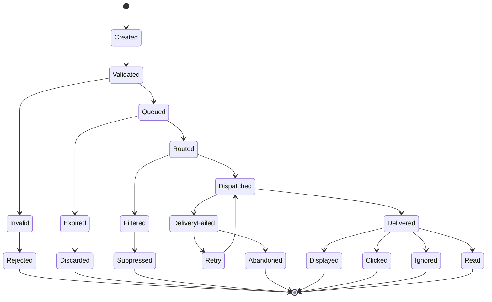
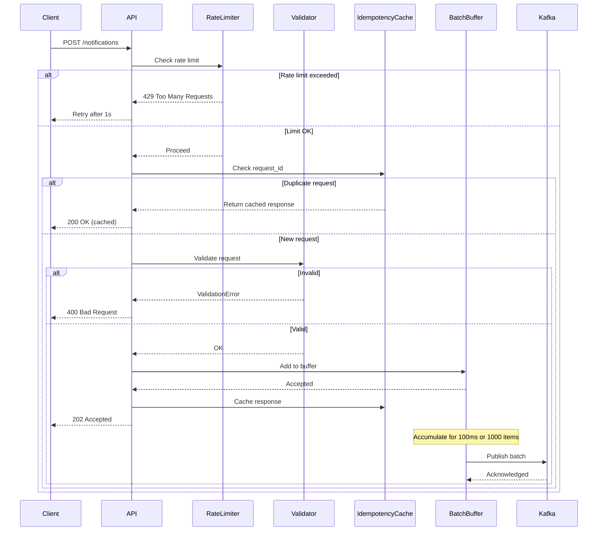
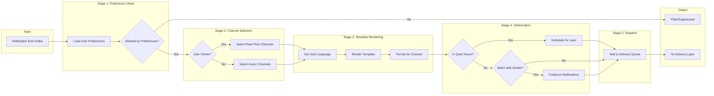
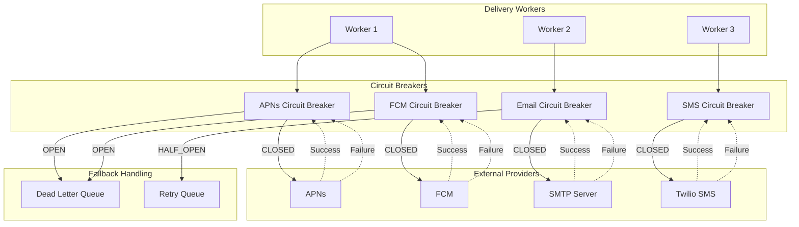
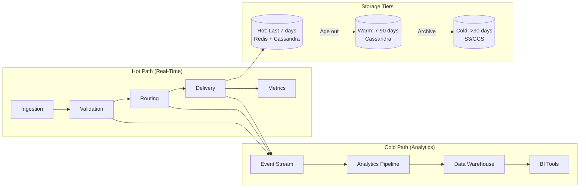
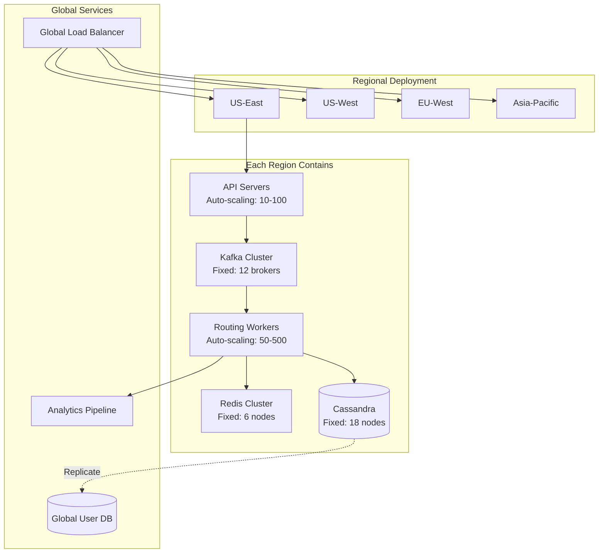

# System Architecture Diagrams

## 1. High-Level System Architecture

## 2. Notification Lifecycle

## 3. Write Path Detail

## 4. Routing Engine Flow

## 5. Delivery Layer with Circuit Breakers

## 6. Distributed Tracing Example

```mermaid
gantt
    title Notification Trace (452ms total)
    dateFormat SSS
    axisFormat %L ms

    section API Layer
    Validate Request           :a1, 000, 12ms
    Check Preferences          :a2, 012, 45ms

    section Routing
    Template Render            :b1, 057, 23ms
    Publish to Kafka           :b2, 080, 8ms

    section Delivery
    Deliver Push               :c1, 088, 364ms
    APNs Send                  :c2, 088, 350ms
    Record Delivery            :c3, 438, 14ms
```

## 7. Data Flow Architecture

## 8. Scaling Strategy

## Architecture Notes

### Scaling Numbers

**Ingestion Layer**:
- API servers: 100 instances × 10K req/sec = 1M req/sec
- Kafka: 12 brokers × 100K msg/sec = 1.2M msg/sec

**Routing Engine**:
- Workers: 500 instances × 2K routes/sec = 1M routes/sec
- Preference cache: 10M users × 25 bytes = 250 MB per region

**Delivery Layer**:
- APNs: 10 certificates × 10K req/sec = 100K req/sec
- FCM: 10 accounts × 15K req/sec = 150K req/sec

**Storage**:
- Hot tier: 700B notifications × 1KB = 700 TB
- Warm tier: 8.3T notifications × 1KB = 8.3 PB
- Cold tier: Unbounded (S3 Glacier)

### Reliability

- Multi-region: 4 regions, any 2 can serve full traffic
- Circuit breakers: Prevent cascade failures
- Rate limiting: Per-service, per-user, per-provider
- Retries: Exponential backoff with jitter
- Dead letter queues: Isolate permanent failures

### Observability

- Metrics: Prometheus (1-minute retention) → Thanos (long-term)
- Tracing: OpenTelemetry → Jaeger (7-day retention)
- Logs: Structured JSON → Elasticsearch (30-day retention)
- Alerts: PagerDuty for critical, Slack for warnings
